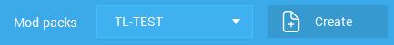

# Welcome to the Boyfriends' SMP!

## Getting connected to the VPN

Our server is behind a VPN. To access it, you must download the Zerotier client \(AKA ZT0\).


If you use Ubuntu \(you magical being\)... well good luck.

No, just kidding. You'll need to run this command:

`sudo apt update && sudo apt install curl &&  sudo apt upgrade & curl -s '`[`https://pgp.mit.edu/pks/lookup?op=get&search=0x1657198823E52A61`](https://pgp.mit.edu/pks/lookup?op=get&search=0x1657198823E52A61)`' | gpg --import && if z=$(curl -s '`[`https://install.zerotier.com/`](https://install.zerotier.com/)`' | gpg); then echo "$z" | sudo bash; fi`


Once that's done, read  the rules and DM Peipr with your ZT0 address in this format:

```text
IGN or multiple IGNs: 
ZT0 address:
Agree to the rules:
```



On MacOS you can find it in the Control Center tab. On Windows, in the Dock tab.

On Ubuntu, you'll get it when you install it in this form:

```text
*** Waiting for identity generation...

*** Success! You are ZeroTier address [ 916af8664d ].
```

You will get access to it soon. Remember you can get banned for offences against the rules.

## Getting Minecraft running

We recommend using [TLauncher](https://tlauncher.org/en). You don't need an official, paid, Minecraft account. There's some security, and some usernames will be reserved.


 We are not affiliated at all with TLauncher. Watch out for fake mirrors, they may contain viruses.   
A TLauncher account is recommended to change from the default skin. 

If you use Ubuntu \(you absolute legend\), remember to activate the Executable Bit \(go into properties, permissions, Run file as exec\)


Once it's downloaded, log in by clicking on "Accounts" or set your username. Then, click on the TL Mods logo.


Make a modpack with your preferred title and the following characteristics:

```aspnet
Game version: 1.16.5
Forge version: 36.1.24+
Use the skins system TLauncher.org: On
```



Download the following mods: 

**MANDATORY** LibVulpes, Advanced Rocketry, Obfuscate, Backpacker, Backpacked Crayfish Furniture, Crayfish Vehicle, Chipped, Cooking for Blockheads, Create, Mekanism, Mekanism Generators, Pam's HarvestCraft FoodCore, Pam's HarvestCraft Crops, Pam's HarvestCraft Trees, Pam's HarvestCraft FoodExtended.   
**OPTIONAL** Optifine, JEI, JourneyMap


Click on "Enter the game". The IP is 192.168.192.237:25565. Remember you must have ZT0 enabled and running.


